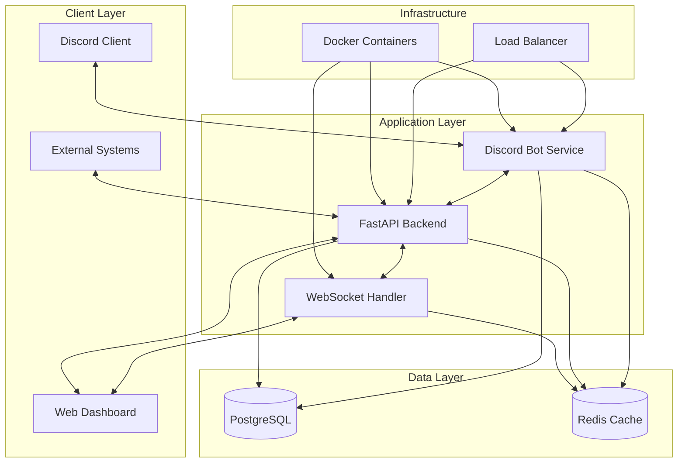

# Design Document

## Overview

The Discord Ticket Bot system is designed as a microservices architecture with three main components: a Discord Bot service, a FastAPI backend service, and a React web dashboard. The system uses PostgreSQL for persistent data storage, Redis for caching and real-time synchronization, and WebSocket connections for live updates across all interfaces.

The architecture prioritizes real-time synchronization, scalability, and maintainability while providing a seamless experience across Discord and web interfaces.

## Architecture

### High-Level Architecture



### Component Responsibilities

**Discord Bot Service (Python + py-cord)**
- Handle Discord slash commands and events
- Manage Discord channel creation and permissions
- Process Discord messages and forward to backend
- Maintain Discord API connection and rate limiting

**FastAPI Backend Service**
- Provide REST API endpoints for external systems
- Handle business logic for ticket management
- Manage database operations and caching
- Coordinate real-time synchronization events

**WebSocket Handler**
- Manage real-time connections with web dashboard
- Broadcast updates between Discord and web interfaces
- Handle connection management and reconnection logic

**React Web Dashboard**
- Provide staff interface for ticket management
- Display real-time ticket updates and conversations
- Handle user authentication and authorization
- Implement search and filtering capabilities

## Components and Interfaces

### Discord Bot Service

**Core Classes:**
- `TicketBot`: Main bot class handling Discord events
- `TicketManager`: Manages ticket lifecycle operations
- `PermissionManager`: Handles Discord channel permissions
- `MessageProcessor`: Processes and formats Discord messages

**Key Interfaces:**
- Discord API integration via py-cord
- HTTP client for backend API communication
- Redis pub/sub for real-time events

**Discord Commands:**
- `/ticket create [subject]` - Create new ticket
- `/ticket close` - Close current ticket
- `/ticket assign @user` - Assign ticket to staff member
- `/ticket transcript` - Generate ticket transcript

### FastAPI Backend Service

**Core Modules:**
- `ticket_service.py`: Business logic for ticket operations
- `transcript_service.py`: Transcript generation and search
- `auth_service.py`: Authentication and authorization
- `websocket_manager.py`: WebSocket connection management

**API Endpoints:**
```
POST /api/tickets - Create new ticket
GET /api/tickets - List tickets with filtering
GET /api/tickets/{id} - Get specific ticket details
PUT /api/tickets/{id} - Update ticket
DELETE /api/tickets/{id} - Close/archive ticket
GET /api/tickets/{id}/transcript - Get ticket transcript
POST /api/tickets/{id}/messages - Add message to ticket
GET /api/search/transcripts - Search ticket transcripts
```

**WebSocket Events:**
- `ticket_created` - New ticket notification
- `ticket_updated` - Ticket status/assignment changes
- `message_added` - New message in ticket
- `ticket_closed` - Ticket closure notification

### Web Dashboard

**Core Components:**
- `TicketList`: Display and filter active tickets
- `TicketDetail`: Show individual ticket conversation
- `TranscriptSearch`: Search across all transcripts
- `StaffManagement`: Manage staff assignments and permissions

**Real-time Features:**
- Live ticket status updates
- Real-time message synchronization
- Notification system for new tickets
- Auto-refresh on connection restore

## Data Models

### Database Schema

**Tickets Table:**
```sql
CREATE TABLE tickets (
    id UUID PRIMARY KEY DEFAULT gen_random_uuid(),
    discord_channel_id BIGINT UNIQUE NOT NULL,
    title VARCHAR(255) NOT NULL,
    description TEXT,
    status VARCHAR(50) NOT NULL DEFAULT 'open',
    priority VARCHAR(20) DEFAULT 'medium',
    creator_discord_id BIGINT NOT NULL,
    assigned_staff_id BIGINT,
    created_at TIMESTAMP DEFAULT CURRENT_TIMESTAMP,
    updated_at TIMESTAMP DEFAULT CURRENT_TIMESTAMP,
    closed_at TIMESTAMP
);
```

**Messages Table:**
```sql
CREATE TABLE messages (
    id UUID PRIMARY KEY DEFAULT gen_random_uuid(),
    ticket_id UUID REFERENCES tickets(id),
    discord_message_id BIGINT UNIQUE,
    author_discord_id BIGINT NOT NULL,
    content TEXT NOT NULL,
    message_type VARCHAR(50) DEFAULT 'user_message',
    created_at TIMESTAMP DEFAULT CURRENT_TIMESTAMP
);
```

**Transcripts Table:**
```sql
CREATE TABLE transcripts (
    id UUID PRIMARY KEY DEFAULT gen_random_uuid(),
    ticket_id UUID REFERENCES tickets(id),
    content TEXT NOT NULL,
    formatted_content JSONB,
    share_token VARCHAR(255) UNIQUE,
    created_at TIMESTAMP DEFAULT CURRENT_TIMESTAMP,
    updated_at TIMESTAMP DEFAULT CURRENT_TIMESTAMP
);
```

**Staff Table:**
```sql
CREATE TABLE staff (
    id UUID PRIMARY KEY DEFAULT gen_random_uuid(),
    discord_id BIGINT UNIQUE NOT NULL,
    username VARCHAR(255) NOT NULL,
    role VARCHAR(50) NOT NULL,
    permissions JSONB DEFAULT '{}',
    active BOOLEAN DEFAULT true,
    created_at TIMESTAMP DEFAULT CURRENT_TIMESTAMP
);
```

### Data Models (Python)

**Ticket Model:**
```python
class Ticket(BaseModel):
    id: UUID
    discord_channel_id: int
    title: str
    description: Optional[str]
    status: TicketStatus
    priority: Priority
    creator_discord_id: int
    assigned_staff_id: Optional[int]
    created_at: datetime
    updated_at: datetime
    closed_at: Optional[datetime]
```

**Message Model:**
```python
class Message(BaseModel):
    id: UUID
    ticket_id: UUID
    discord_message_id: Optional[int]
    author_discord_id: int
    content: str
    message_type: MessageType
    created_at: datetime
```

## Error Handling

### Discord Bot Error Handling
- **Rate Limiting**: Implement exponential backoff for Discord API calls
- **Connection Loss**: Auto-reconnect with state recovery
- **Permission Errors**: Graceful degradation with user notification
- **Command Errors**: User-friendly error messages with logging

### API Error Handling
- **Database Errors**: Transaction rollback with retry logic
- **Authentication Errors**: Clear error responses with proper HTTP codes
- **Validation Errors**: Detailed field-level error messages
- **Rate Limiting**: HTTP 429 responses with retry-after headers

### WebSocket Error Handling
- **Connection Drops**: Automatic reconnection with exponential backoff
- **Message Delivery**: Acknowledgment system with retry logic
- **State Synchronization**: Full state refresh on reconnection
- **Error Broadcasting**: Error notifications to connected clients

### Synchronization Error Handling
- **Discord-API Sync Failures**: Queue failed operations for retry
- **Database Inconsistencies**: Conflict resolution with audit logging
- **Cache Invalidation**: Automatic cache refresh on data changes
- **Partial Failures**: Continue operation with degraded functionality

## Testing Strategy

### Unit Testing
- **Discord Bot**: Mock Discord API responses and test command handlers
- **FastAPI Backend**: Test API endpoints with test database
- **Business Logic**: Test ticket lifecycle and permission management
- **Data Models**: Validate model serialization and validation

### Integration Testing
- **Discord-Backend Integration**: Test real-time synchronization
- **Database Operations**: Test complex queries and transactions
- **WebSocket Communication**: Test real-time event broadcasting
- **External API Integration**: Test third-party system interactions

### End-to-End Testing
- **Complete Ticket Lifecycle**: Test ticket creation through closure
- **Multi-Interface Synchronization**: Test Discord and web dashboard sync
- **Permission Management**: Test access control across interfaces
- **Transcript Generation**: Test transcript creation and search

### Performance Testing
- **Load Testing**: Test system under high ticket volume
- **Stress Testing**: Test system limits and failure modes
- **Real-time Performance**: Test WebSocket message delivery latency
- **Database Performance**: Test query performance under load

### Security Testing
- **Authentication Testing**: Test API authentication and authorization
- **Permission Testing**: Test Discord channel access controls
- **Input Validation**: Test against injection attacks
- **Rate Limiting**: Test API rate limiting effectiveness

## Deployment Architecture

### Docker Configuration
- **Multi-stage builds** for optimized container sizes
- **Health checks** for container orchestration
- **Environment-based configuration** for different deployment stages
- **Volume mounts** for persistent data and logs

### Container Services
- `discord-bot`: Discord bot service with py-cord
- `fastapi-backend`: API service with WebSocket support
- `react-dashboard`: Static web dashboard served by nginx
- `postgresql`: Database service with persistent volumes
- `redis`: Cache and pub/sub service
- `nginx`: Reverse proxy and load balancer

### Environment Configuration
- **Development**: Single-node deployment with hot reloading
- **Staging**: Multi-container deployment with test data
- **Production**: Scaled deployment with monitoring and backups

### Monitoring and Logging
- **Application Logs**: Structured logging with correlation IDs
- **Performance Metrics**: Response times and throughput monitoring
- **Error Tracking**: Centralized error collection and alerting
- **Health Monitoring**: Service health checks and uptime monitoring