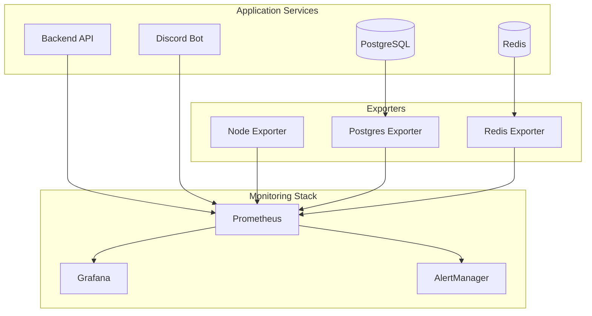
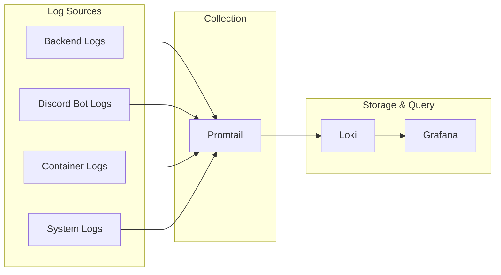

# Monitoring and Observability Guide

This document provides comprehensive information about monitoring, logging, and observability for the Discord Ticket Bot system.

## Overview

The Discord Ticket Bot includes a complete observability stack with:

- **Metrics Collection**: Prometheus for time-series metrics
- **Visualization**: Grafana for dashboards and alerts
- **Log Aggregation**: Loki for centralized logging
- **Distributed Tracing**: Jaeger for request tracing
- **Alerting**: AlertManager for notification management
- **Health Checks**: Built-in health endpoints for all services

## Quick Start

### Start Monitoring Stack

```bash
# Start the main application first
./start.sh

# Start monitoring services
./start-monitoring.sh
```

### Access Monitoring Services

- **Grafana**: http://localhost:3001 (admin/admin)
- **Prometheus**: http://localhost:9090
- **AlertManager**: http://localhost:9093
- **Loki**: http://localhost:3100
- **Jaeger**: http://localhost:16686

## Architecture

### Metrics Collection



### Logging Pipeline



## Metrics

### Application Metrics

#### Backend API Metrics
- `http_requests_total`: Total HTTP requests
- `http_request_duration_seconds`: Request duration histogram
- `active_websocket_connections`: Active WebSocket connections
- `database_queries_total`: Total database queries
- `redis_operations_total`: Total Redis operations
- `errors_total`: Total errors

#### Discord Bot Metrics
- `discord_bot_commands_total`: Total commands executed
- `discord_bot_messages_processed`: Messages processed
- `discord_bot_guilds_connected`: Connected guilds
- `discord_bot_users_interacted`: Unique users interacted with
- `discord_bot_uptime_seconds`: Bot uptime

#### Business Metrics
- `tickets_total`: Total tickets in system
- `tickets_open`: Currently open tickets
- `tickets_created_total`: Total tickets created
- `messages_total`: Total messages in system

### System Metrics

#### Resource Metrics
- `node_cpu_seconds_total`: CPU usage by mode
- `node_memory_MemTotal_bytes`: Total system memory
- `node_memory_MemAvailable_bytes`: Available memory
- `node_filesystem_size_bytes`: Filesystem size
- `node_filesystem_avail_bytes`: Available filesystem space

#### Database Metrics
- `pg_up`: PostgreSQL availability
- `pg_stat_database_numbackends`: Active connections
- `pg_stat_database_tup_returned`: Tuples returned
- `pg_stat_database_tup_fetched`: Tuples fetched

#### Redis Metrics
- `redis_up`: Redis availability
- `redis_memory_used_bytes`: Memory usage
- `redis_connected_clients`: Connected clients
- `redis_commands_processed_total`: Commands processed

## Health Checks

### Backend Health Check

```bash
curl http://localhost:8000/health
```

Response:
```json
{
  "status": "healthy",
  "service": "discord-ticket-bot-backend",
  "database": {
    "status": "connected",
    "response_time_ms": 5.2
  },
  "redis": {
    "status": "healthy",
    "response_time_ms": 1.8
  }
}
```

### Discord Bot Health Check

```bash
curl http://localhost:8080/health
```

Response:
```json
{
  "status": "healthy",
  "service": "discord-ticket-bot",
  "discord_connected": true,
  "backend_connected": true,
  "redis_connected": true,
  "uptime_seconds": 3600
}
```

### Detailed Metrics Endpoints

#### Backend Metrics
- `/metrics/health`: Detailed health check
- `/metrics/application`: Application metrics
- `/metrics/system`: System resource metrics
- `/metrics/database`: Database-specific metrics
- `/metrics/redis`: Redis-specific metrics
- `/metrics/prometheus`: Prometheus format metrics

#### Discord Bot Metrics
- `/health`: Health status
- `/metrics`: Application metrics

## Logging

### Log Formats

#### Structured JSON Logging (Production)
```json
{
  "timestamp": "2024-01-15T10:30:00.000Z",
  "level": "INFO",
  "logger": "backend.api",
  "message": "Request completed",
  "service": "backend",
  "request_id": "123e4567-e89b-12d3-a456-426614174000",
  "method": "GET",
  "url": "/api/tickets",
  "status_code": 200,
  "process_time_ms": 45.2
}
```

#### Human-Readable Logging (Development)
```
2024-01-15 10:30:00 - backend.api - INFO - [123e4567] - Request completed
```

### Log Levels

- **DEBUG**: Detailed diagnostic information
- **INFO**: General operational messages
- **WARNING**: Warning messages for potential issues
- **ERROR**: Error messages for failures
- **CRITICAL**: Critical errors requiring immediate attention

### Log Categories

#### Backend Logs
- `backend.api`: API request/response logs
- `backend.database`: Database operation logs
- `backend.redis`: Redis operation logs
- `backend.websocket`: WebSocket connection logs
- `backend.monitoring`: Monitoring and metrics logs

#### Discord Bot Logs
- `discord_bot.commands`: Command execution logs
- `discord_bot.events`: Discord event logs
- `discord_bot.sync`: Synchronization logs
- `discord_bot.api`: Backend API interaction logs

## Alerting

### Alert Rules

#### Critical Alerts
- **ServiceDown**: Service is not responding
- **BackendDatabaseConnectionFailed**: Database connection lost
- **DiscordBotDisconnected**: Discord bot disconnected
- **PostgreSQLDown**: Database server down
- **RedisDown**: Redis server down

#### Warning Alerts
- **BackendHighErrorRate**: High error rate in API
- **BackendHighResponseTime**: Slow API responses
- **DiscordBotHighCommandFailureRate**: High command failure rate
- **PostgreSQLHighConnections**: High database connection usage
- **RedisHighMemoryUsage**: High Redis memory usage
- **HighCPUUsage**: High system CPU usage
- **HighMemoryUsage**: High system memory usage
- **HighDiskUsage**: High disk usage

#### Info Alerts
- **HighTicketCreationRate**: Unusual ticket creation activity
- **LongRunningTickets**: Many old open tickets
- **WebSocketConnectionsHigh**: High WebSocket usage

### Alert Configuration

Edit `monitoring/alertmanager.yml` to configure notifications:

```yaml
receivers:
  - name: 'email-alerts'
    email_configs:
      - to: 'admin@example.com'
        subject: 'Alert: {{ .GroupLabels.alertname }}'
        body: |
          {{ range .Alerts }}
          Alert: {{ .Annotations.summary }}
          Description: {{ .Annotations.description }}
          {{ end }}

  - name: 'slack-alerts'
    slack_configs:
      - api_url: 'YOUR_SLACK_WEBHOOK_URL'
        channel: '#alerts'
        title: 'Alert: {{ .GroupLabels.alertname }}'
        text: '{{ range .Alerts }}{{ .Annotations.description }}{{ end }}'
```

## Dashboards

### Grafana Dashboard Setup

1. **Access Grafana**: http://localhost:3001
2. **Login**: admin/admin (change on first login)
3. **Import Dashboards**: Use dashboard IDs or JSON files

### Recommended Dashboards

#### System Overview Dashboard
- System resource usage (CPU, Memory, Disk)
- Network I/O statistics
- Service availability status
- Alert summary

#### Application Dashboard
- Request rates and response times
- Error rates and types
- WebSocket connections
- Database and Redis performance

#### Business Metrics Dashboard
- Ticket creation and resolution rates
- User activity metrics
- Support team performance
- System usage trends

### Custom Dashboard Creation

```json
{
  "dashboard": {
    "title": "Discord Ticket Bot Overview",
    "panels": [
      {
        "title": "Request Rate",
        "type": "graph",
        "targets": [
          {
            "expr": "rate(http_requests_total[5m])",
            "legendFormat": "{{method}} {{status}}"
          }
        ]
      }
    ]
  }
}
```

## Performance Monitoring

### Key Performance Indicators (KPIs)

#### Response Time Metrics
- API response time percentiles (p50, p95, p99)
- Database query execution times
- Redis operation latencies
- WebSocket message delivery times

#### Throughput Metrics
- Requests per second
- Messages processed per second
- Tickets created per hour
- Commands executed per minute

#### Error Metrics
- Error rate percentage
- Error types and frequencies
- Failed request patterns
- Exception occurrences

### Performance Baselines

#### API Performance
- **Target Response Time**: < 200ms (p95)
- **Maximum Response Time**: < 2s (p99)
- **Error Rate**: < 1%
- **Availability**: > 99.9%

#### Database Performance
- **Query Time**: < 100ms (average)
- **Connection Usage**: < 80% of max
- **Lock Wait Time**: < 10ms
- **Cache Hit Rate**: > 95%

## Troubleshooting

### Common Issues

#### High Memory Usage
```bash
# Check memory usage
curl http://localhost:8000/metrics/system | jq '.memory'

# Check for memory leaks
docker stats

# Restart services if needed
docker-compose restart backend
```

#### Database Connection Issues
```bash
# Check database health
curl http://localhost:8000/metrics/database

# Check connection pool
docker-compose exec postgres psql -U ticketbot -c "SELECT * FROM pg_stat_activity;"

# Reset connections
docker-compose restart backend discord-bot
```

#### High Error Rates
```bash
# Check error logs
docker-compose logs backend | grep ERROR

# Check error metrics
curl http://localhost:8000/metrics/prometheus | grep errors_total

# Check alert status
curl http://localhost:9093/api/v1/alerts
```

### Debug Mode

Enable debug logging:

```bash
# Set environment variables
export LOG_LEVEL=DEBUG
export DEBUG=true

# Restart services
docker-compose restart backend discord-bot
```

### Log Analysis

#### Search Logs in Loki
```logql
# Error logs from backend
{service="backend"} |= "ERROR"

# Slow queries
{service="backend"} | json | duration > 1s

# Discord bot command failures
{service="discord-bot"} |= "command" |= "failed"
```

#### Prometheus Queries
```promql
# Request rate by status code
sum(rate(http_requests_total[5m])) by (status_code)

# Error rate percentage
sum(rate(http_requests_total{status_code=~"5.."}[5m])) / sum(rate(http_requests_total[5m])) * 100

# Response time percentiles
histogram_quantile(0.95, sum(rate(http_request_duration_seconds_bucket[5m])) by (le))
```

## Maintenance

### Regular Tasks

#### Daily
- Review alert notifications
- Check system resource usage
- Monitor error rates and patterns
- Verify backup completion

#### Weekly
- Review performance trends
- Update alert thresholds if needed
- Clean up old logs and metrics
- Check for security updates

#### Monthly
- Review and update dashboards
- Analyze capacity planning metrics
- Update monitoring documentation
- Test disaster recovery procedures

### Data Retention

#### Metrics Retention
- **Prometheus**: 30 days (configurable)
- **Grafana**: Unlimited (dashboard configs)

#### Log Retention
- **Loki**: 30 days (configurable)
- **Container Logs**: 7 days (Docker default)

#### Cleanup Commands
```bash
# Clean up old Docker logs
docker system prune -f

# Clean up old metrics (if needed)
docker-compose exec prometheus rm -rf /prometheus/data/old

# Restart services to free memory
docker-compose restart prometheus grafana
```

## Security

### Access Control
- Grafana authentication required
- Prometheus metrics endpoints protected
- AlertManager configuration secured
- Log access restricted

### Network Security
- Internal monitoring network
- No external exposure of monitoring ports
- TLS encryption for external access
- Rate limiting on metrics endpoints

### Data Privacy
- No sensitive data in logs
- Metrics anonymization
- Secure credential storage
- Regular security audits

## Integration

### CI/CD Integration

#### GitHub Actions Example
```yaml
- name: Check Service Health
  run: |
    curl -f http://localhost:8000/health
    curl -f http://localhost:8080/health

- name: Collect Metrics
  run: |
    curl http://localhost:8000/metrics/prometheus > metrics.txt
    # Upload to monitoring system
```

#### Deployment Monitoring
```bash
# Pre-deployment health check
./health-check.sh -e production

# Post-deployment verification
sleep 30
./health-check.sh -e production

# Monitor deployment metrics
curl http://localhost:9090/api/v1/query?query=up
```

### External Integrations

#### Webhook Notifications
Configure AlertManager to send webhooks to external systems:

```yaml
webhook_configs:
  - url: 'https://hooks.slack.com/services/YOUR/SLACK/WEBHOOK'
  - url: 'https://api.pagerduty.com/integration/YOUR_KEY/enqueue'
```

#### Metrics Export
Export metrics to external monitoring systems:

```bash
# Export to external Prometheus
curl http://localhost:9090/api/v1/query_range?query=up > external_metrics.json

# Send to external systems
curl -X POST https://external-monitoring.com/api/metrics -d @external_metrics.json
```

## Support

For monitoring-related issues:

1. Check service health endpoints
2. Review Grafana dashboards
3. Examine Prometheus targets
4. Check AlertManager status
5. Review log aggregation in Loki
6. Consult troubleshooting section
7. Check system resource usage